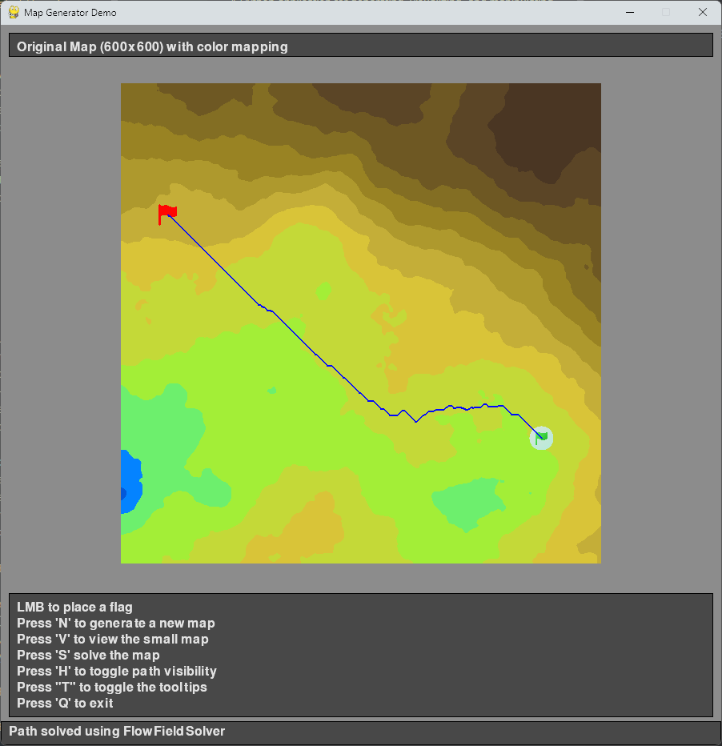

# Map Solver Playground

A Python application for generating, visualizing, and manipulating 2D map data. This project provides tools for creating
terrain maps, applying filters, and visualizing the results using Pygame.



## Features

- Generate terrain maps using various algorithms
- Apply filters to modify map data
- Visualize maps with customizable color gradients
- Interactive UI with keyboard controls
- Performance metrics for measuring execution time

## Installation

```bash
# Clone the repository
git clone https://github.com/yourusername/map-solver-playground.git
cd map-solver-playground

# Install the package
pip install -e .
```

## Usage

Run the main application:

```bash
python -m map_solver_playground
```

### Keyboard Controls

- `ESC`: Exit the application
- `N`: Generate a new map
- `S`: Switch between original and small map views
- `H`: Toggle tooltip visibility

## Project Structure

```
map_solver_playground/
├── components/       # UI components
├── maps/             # Map data and manipulation
│   ├── filters/      # Map filters
│   ├── generators/   # Map generation algorithms
│   └── visualization/# Map visualization tools
└── metrics/          # Performance measurement utilities
```

## License

This project is licensed under the MIT License - see the [LICENSE](LICENSE) file for details.